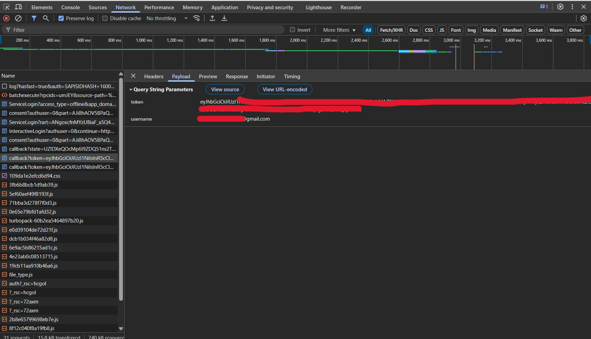

# Authflow-Go

Authflow-Go is a lightweight **authentication and authorization service** written in Go.  
It handles **user authentication via OAuth providers** (Google) and **issues signed JWTs** that can be used by downstream services for authorization.

This project is designed to act as a **central auth service** in a microservice or API-based architecture.

---

## What This Project Is

Authflow-Go functions as:

 **Authentication Server**  
- Handles OAuth login (Google)
- Manages secure user sessions

 **Authorization Token Issuer**  
- Issues signed JWT access tokens
- Tokens can be consumed by other services for authorization

➡️ In practice, this makes Authflow-Go an **Authorization Server for your system**, though it is **not a full OAuth 2.0 Authorization Server implementation** (like Keycloak or Auth0).

---

## 🚫 What This Project Is NOT

- ❌ Not a complete OAuth 2.0 / OpenID Connect provider
- ❌ Does not issue authorization codes to third-party clients
- ❌ Does not manage users in a database (yet)

Instead, it focuses on **simple, secure auth flows** for modern backend systems.

---

## Features

- Google OAuth 2.0 authentication (via Goth)
- Secure cookie-based session management
- JWT access token generation (HS256)
- Environment-aware security settings
- Clean Go project structure
- Ready for microservice integration

---

## Authentication Flow

1. User initiates OAuth login
2. Google authenticates the user
3. Authflow-Go creates a secure session
4. A JWT access token is generated
5. Client uses JWT to access protected APIs

---

## JWT Claims

Tokens issued by Authflow-Go contain:

- `email` – authenticated user identifier
- `sub` – subject (user)
- `iss` – issuer (`authflow-go`)
- `iat` – issued at
- `exp` – expiration time (24 hours)

---
## OAuth Flow Verification

> OAuth callback validation relies on provider-issued authorization
> codes and session cookies established during browser-based authentication.
> As such, callback verification is demonstrated via browser network traces
> rather than Postman.

---

### 1️⃣ OAuth Initiation (Postman)

  

  <em>
    AuthFlow initiates OAuth 2.0 authentication by redirecting the client to
    Google’s authorization endpoint, establishing a secure session for
    callback validation.
  </em>

---

### 2️⃣ Google Authentication & Consent

  

  <em>
    User authentication and consent are handled by Google, which acts as the
    external identity provider.
  </em>

---

### 3️⃣ OAuth Callback Handling (Authorization Code Exchange)

  

  <em>
    Google redirects back to AuthFlow’s callback endpoint, where the
    authorization code and state are validated and exchanged for provider
    credentials.
  </em>

---

### 4️⃣ Application JWT Issuance

  

  <em>
    After successful OAuth validation, AuthFlow issues an application-scoped
    JWT and securely redirects it to the client application along with the
    mapped user identity.
  </em>

---

## Authentication Architecture

  

  <em>
    High-level authentication flow illustrating OAuth-based identity
    verification and application-level JWT issuance.
  </em>

