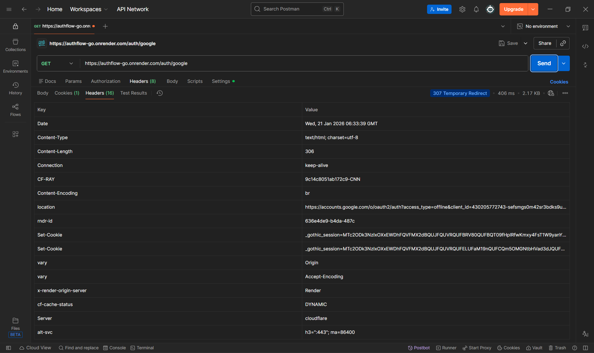
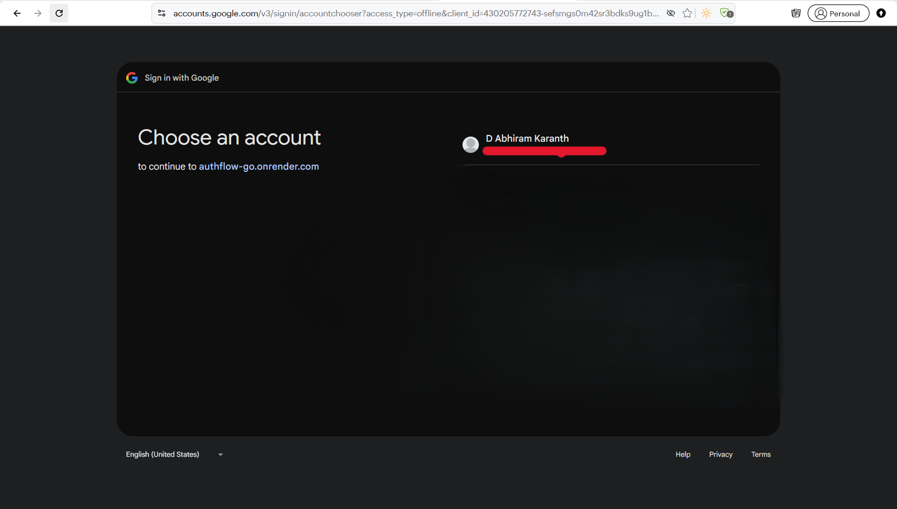
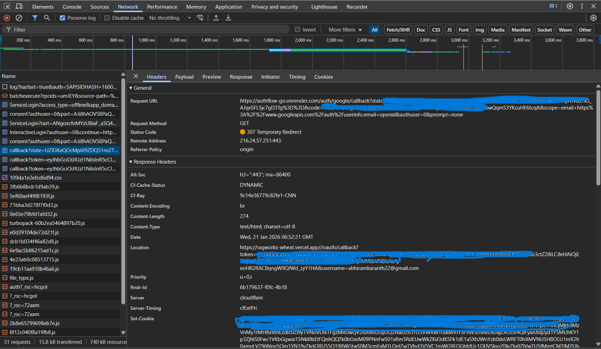
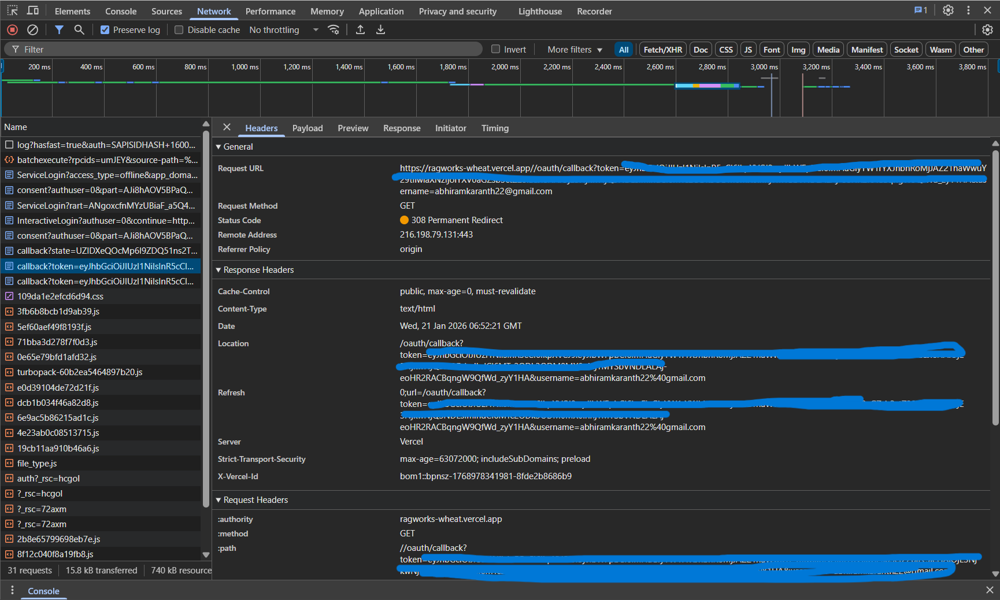
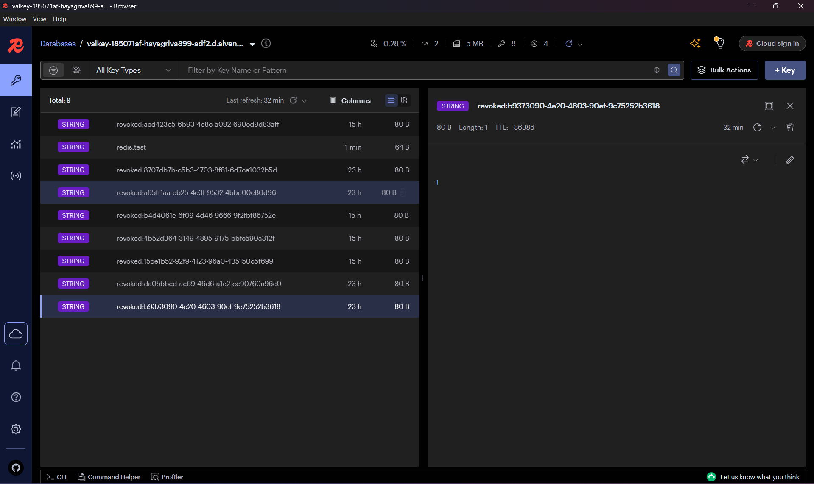

# Authflow-Go

**Authflow-Go** is a centralized authorization service written in Go.  
It issues application-level JWTs, integrates with OAuth providers for identity verification, and enforces secure logout using Redis-backed token revocation.

The service is designed to be used by platforms that manage how users authenticate (OAuth, username/password, SSO, etc.) while delegating authorization, token lifecycle, and revocation to a single trusted service.

---

## What This Project Is

Authflow-Go functions as:

### Authorization Service (Primary Role)
- Issues signed JWT access tokens
- Enforces token revocation using Redis
- Acts as the single JWT authority for the system

### Authentication Integrator (Secondary Role)
- Supports OAuth 2.0 login (Google) for identity verification
- Establishes secure browser sessions during OAuth flows


---

## Key Design Principle

**Authentication and authorization are intentionally decoupled.**

- **Platforms** decide how users authenticate
- **Authflow-Go** decides how access is granted and revoked

This enables:
- A single JWT issuer
- Consistent logout semantics
- Stateless downstream services
- Centralized security guarantees

---

## Features

 -> Centralized JWT issuance (`/mint`)  
 -> OAuth 2.0 authentication (Google via Goth)  
 -> Redis-backed JWT revocation (secure logout)  
 -> Stateless JWT validation middleware  
 -> Provider-agnostic token design  
 -> Clean Go project structure  
 -> Microservice-friendly architecture

---

## Core Endpoints
```
GET  /auth/{provider}
GET  /auth/{provider}/callback

POST /mint
POST /logout
```

---

## Token Issuance (`/mint`)

Authflow-Go exposes a token minting endpoint that issues JWTs **after authentication has already occurred**.

### Request
```http
POST /mint
Content-Type: application/json

{
  "sub": "username",
  "provider": "google | local | sso",
  "email": "user@example.com"   // optional
}
```

### Response
```json
{
  "access_token": "eyJhbGciOiJIUzI1NiIs..."
}
```

### ⚠️ Important Notes
- `/mint` **does not authenticate users**
- It assumes the caller has already verified identity
- This allows platforms to use **any authentication strategy**

---

## Logout & Token Revocation

Logout is implemented as **JWT revocation**, not session destruction.

### Flow
1. Client calls `POST /logout` with a Bearer token
2. Authflow-Go:
   - Validates the JWT
   - Extracts the `jti` claim
   - Writes `revoked:<jti>` to Redis
3. Redis entry expires automatically when the JWT would expire

### Why Redis?
-  Immediate logout
-  Stateless JWT validation
-  Automatic cleanup via TTL
-  No persistent blacklist storage

### Redis Revocation Model
```
revoked:<jti> → "1" (TTL = token_expiry − now)
```

Any request using a revoked token is rejected by middleware, even if the JWT is otherwise valid.

---

## JWT Claims

Tokens issued by Authflow-Go contain:

| Claim      | Description                          |
|------------|--------------------------------------|
| `sub`      | Subject (user identifier)            |
| `iss`      | Issuer (`authflow-go`)               |
| `jti`      | Unique token ID                      |
| `iat`      | Issued at                            |
| `exp`      | Expiration time                      |
| `provider` | Authentication source (e.g., `google`, `local`) |

---

## Authentication & Authorization Flow
<p align="center">  </p> <p align="center"> <em> End-to-end flow showing OAuth authentication, centralized JWT issuance, Redis-backed token revocation, and protected resource access. </em> </p>


### 1️⃣ OAuth Initiation (Postman)

<p align="center">
  
</p>

<p align="center">
  <em>
    AuthFlow initiates OAuth 2.0 authentication by redirecting the client to
    Google’s authorization endpoint, establishing a secure session for
    callback validation.
  </em>
</p>

---

### 2️⃣ Google Authentication & Consent

<p align="center">
  
</p>

<p align="center">
  <em>
    User authentication and consent are handled by Google, which acts as the
    external identity provider.
  </em>
</p>

---

### 3️⃣ OAuth Callback Handling (Authorization Code Exchange)

<p align="center">
  
</p>

<p align="center">
  <em>
    Google redirects back to AuthFlow’s callback endpoint, where the
    authorization code and state are validated and exchanged for provider
    credentials.
  </em>
</p>

---

### 4️⃣ Application JWT Issuance

<p align="center">
  
</p>

<p align="center">
  <em>
    After successful OAuth validation, AuthFlow issues an application-scoped
    JWT and securely redirects it to the client application along with the
    mapped user identity.
  </em>
</p>

---
### 5️⃣ Token Revocation & Logout (Redis)
<p align="center">  </p> <p align="center"> <em> When a client initiates logout, AuthFlow validates the JWT, extracts the token’s <code>jti</code> claim, and stores it in Redis as a revocation entry with a TTL equal to the remaining token lifetime. Any subsequent request using this JWT is rejected, even if the token has not yet expired. </em> </p>

### OAuth Authentication Flow
1. User initiates OAuth login
2. OAuth provider authenticates the user
3. Authflow-Go validates the callback and establishes a session
4. Authflow-Go issues an internal application JWT
5. Client uses the JWT for API access


### Protected Resource Access
1. Client sends `Authorization: Bearer <JWT>`
2. Middleware:
   - Verifies signature & expiry
   - Checks Redis for `revoked:<jti>`
3. Request proceeds only if the token is **valid and not revoked**

---

## Security Model Summary

✅ Single JWT issuer (Authflow-Go)  
✅ Stateless authorization using JWTs  
✅ Immediate logout via Redis  
✅ OAuth sessions cleared as best-effort cleanup  
✅ Downstream services never mint tokens

---


## Why This Architecture

This design mirrors real-world systems where:

- Authentication strategies vary per platform
- Authorization is centralized
- Token lifecycle is controlled in one place
- Logout is enforceable across services


---


